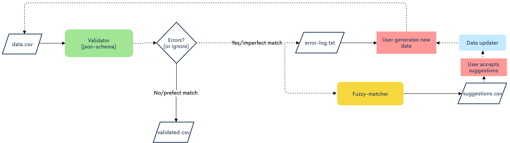

# Fuzzy-Matcher
This package validates data defined by a schema, outputting a log of errors. It was designed to validate data to be used in a project developed by the [Research On Research Insitute](http://researchonresearch.org). 

In addition to validating entries, if your schema contains a field representing a unversity name, the package tries to fuzzy match the name to a standard name in the [GRID database](https://digitalscience.figshare.com/articles/dataset/GRID_release_2020-10-06/13084304) (distributed under CC0), enabling the user to correct invalid entries. A full description of the components can be found [below](#Validator).
## Quickstart

Pre-requisites: Python 3.6+, pip

Clone the repository in your terminal and install the requirements (potentially in a virtual environment):

```bash
git clone git@github.com:India-Alliance/Fuzzy-Matcher.git
cd Fuzzy-Matcher
pip install -r requirements.txt 
```
Add your schema file (json) in data/json-schema/main-json-schema.json

A test.csv is provided with some usual columns. If you only want to just validate your data:

```bash
 python driver.py test.csv -m -v
```

If you want to use the fuzzy matcher, you need to provide which columns contain university names:

```bash
python driver.py test.csv -m -l affiliation_proposed affiliation_current -v
```

This generates a file, `Suggestions.csv`, with a column called `'Correct (1/0)'` where the user determines whether to accept or reject each suggestions.

After this, you can run:
```bash
python updater.py Suggestions.csv affiliation_current # or any column name to update 
```

And it will update the fuzzy matched entries in your csv.

## Components

The module is broadely divided into three main parts :-
1. Validator
2. Matcher
3. Updater

Here is a flow chart of how the fuzzy matcher works:



### Validator

Validation is done via specifying a schema as json.
The parent file is `main-schema.json`. As of the first release, we are pushing currency and university name validations.
The specific schema requirements are specified in their own schema files, `currencies.json` and `universities.json` respectively.

#### So, what does the Validator do ?

The Validator performs a simple sanity check on the data entered and returns the non-conformant data. In layman terms, the validator performs a sort of simple string comparison over the requested entities. The entries which are not exactly matched or are in an unconventional format, example, a digit in university name or a four letter currency ISO code, are identified here. This sets the stage for our Fuzzy-Matcher.

### Matcher

Matcher uses the `fuzzywuzzy` library. It computes the [Levenshtein distance](https://en.wikipedia.org/wiki/Levenshtein_distance#:~:text=Informally%2C%20the%20Levenshtein%20distance%20between,considered%20this%20distance%20in%201965.) for   string comparison.

The matcher takes in the non-exact matches as returned by the validator. It then tries to fuzzy match these names against our standard list obtained from [grid.ac](https://grid.ac/downloads).

### Updater

This is a simple script that overwrites the non-conformant entries after the user reviews them. This is run separately since it can run only after the user reviews the suggestions by the matcher.
